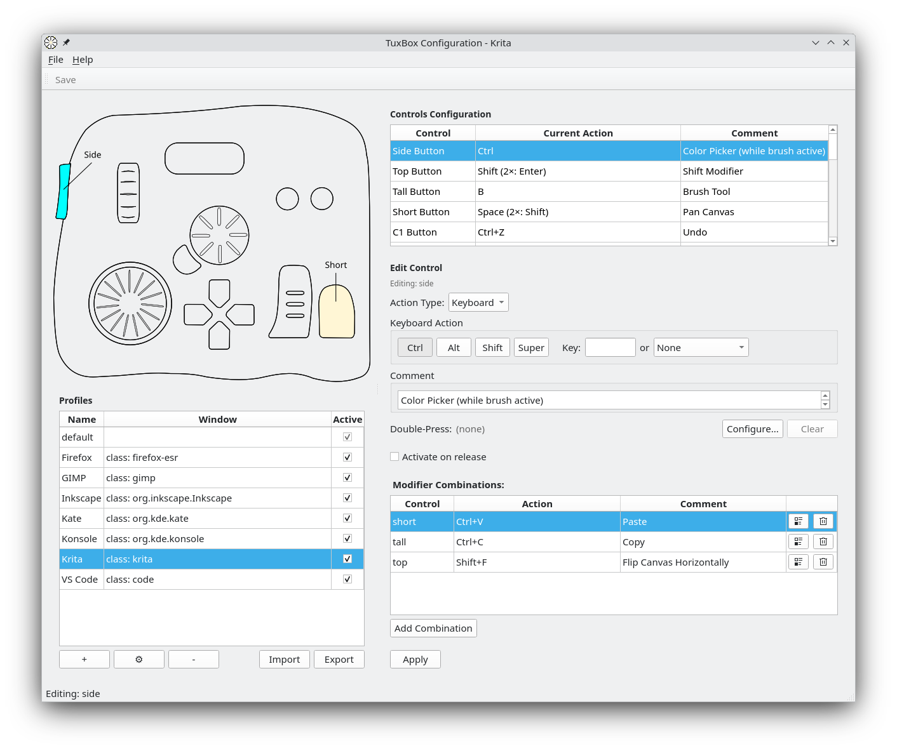

# TourBox Elite Linux Driver

[](https://opensource.org/licenses/MIT)
[](https://www.linux.org/)
[](https://www.python.org/downloads/)

Linux driver for the TourBox Elite - a Bluetooth Low Energy (BLE) input device by TourBox Tech Inc. This driver translates BLE input events to Linux input events via evdev/uinput.

> **⚠️ Important:** This driver is for **Bluetooth connections only**. It does **NOT** support USB connections.

## Features

- ✅ **Graphical Configuration** - Full-featured GUI for visual configuration with live preview
- ✅ **Bluetooth LE Support** - Wireless connection via BLE
- ✅ **Full Button Mapping** - All 20 controls configurable (buttons, knobs, scroll wheel, dial)
- ✅ **Application Profiles** - Different button mappings per application (Wayland only)
- ✅ **Window Detection** - Automatic profile switching based on focused window
- ✅ **Systemd Integration** - Runs as a user service, starts on login
- ✅ **Flexible Configuration** - Graphical GUI or manual INI-style config file editing

## Requirements

### System Requirements

- Linux (Debian, Ubuntu, Fedora, Arch tested)
- Python 3.9+
- Bluetooth support (bluez)
- Build tools for compiling Python packages:
  - **Debian/Ubuntu:** `gcc python3-dev linux-headers-generic`
  - **Fedora/RHEL:** `gcc python3-devel kernel-headers`
  - **Arch:** `gcc python linux-headers`
- Running on Wayland (for app-specific profiles) or X11 (default profile only)

> **Note:** The `install.sh` script will check for these dependencies and tell you what to install if anything is missing.

### Python Dependencies

- **For GUI configuration tool:**
  - PySide6 >= 6.5.0 (Qt6 for Python)
  - qasync >= 0.24.0 (async Qt support)
  - Automatically installed by `install.sh`

### Additional Requirements for Profile Mode

- **For profile mode (app-specific mappings):**
  - **KDE Plasma:** `kdotool` required (see installation instructions below)
  - **GNOME:** [Focused Window D-Bus extension](https://extensions.gnome.org/extension/5592/focused-window-d-bus/) required (see installation instructions below)
  - **Sway/Hyprland:** No additional requirements

## Quick Install

> **Note:** You do NOT need to pair the TourBox Elite via Bluetooth settings. Pairing is not required and won't work. The driver connects directly to the device using its MAC address.

### Step 1: Find Your TourBox MAC Address

First, make sure your TourBox Elite is powered on and in Bluetooth mode. Do not connect with the USB cable.

Open a terminal and scan for your TourBox:

```bash
bluetoothctl devices
```

Look for a device named "TourBox Elite" in the output. The MAC address will look like `XX:XX:XX:XX:XX:XX`. Copy this address - you'll need it in Step 2 or 3.

Example output:
```
Device 12:34:56:78:9A:BC TourBox Elite
```

### Step 2: Run the Installer

```bash
git clone https://github.com/AndyCappDev/tourboxelite.git
cd tourboxelite
./install.sh
```

The installer will:
1. Create a Python virtual environment
2. Install the driver and dependencies
3. Set up your configuration file
4. Install and enable the systemd service

Log off and log back on again or reboot

### Step 3: Configure Your MAC Address

If you did not provide the MAC address during installation, edit the configuration file and add your TourBox MAC address:

```bash
nano ~/.config/tourbox/mappings.conf
```

Find the `[device]` section at the top of the file and set your MAC address:

```ini
[device]
mac_address = 12:34:56:78:9A:BC  # Replace with your actual MAC address
```

Save the file (Ctrl+O, Enter, Ctrl+X in nano).

You will need to log out and log back in or reboot to activate the driver after installation.

### Additional Step for KDE Plasma Users

If you're using KDE Plasma on Wayland and want profile mode (app-specific mappings), you need to install `kdotool`:

```bash
# 1. Install build dependencies
sudo apt install build-essential pkg-config libdbus-1-dev libxcb1-dev

# 2. Install Rust (if not already installed)
curl --proto '=https' --tlsv1.2 -sSf https://sh.rustup.rs | sh
# Choose option 1 for standard installation when prompted
source $HOME/.cargo/env

# 3. Install kdotool
cargo install kdotool

# 4. Verify installation
kdotool --version
```

### Additional Step for GNOME Users

If you're using GNOME on Wayland and want profile mode (app-specific mappings), you need to install the "Focused Window D-Bus" extension:

1. Visit [Focused Window D-Bus extension page](https://extensions.gnome.org/extension/5592/focused-window-d-bus/)
2. Click the Install button
3. Verify installation:
   ```bash
   gnome-extensions list | grep focused-window-dbus
   # Should show: focused-window-dbus@flexagoon.com
   ```

Without this extension, profile mode will not work on GNOME (the driver will use the default profile for all apps).

**Note:** Sway and Hyprland users don't need any additional software.

## Configuration GUI

The driver includes a **graphical configuration tool** that makes it easy to configure button mappings without editing config files manually.



### Running the GUI

After installation, simply run:

```bash
tourbox-gui
```

### What You Can Do with the GUI

- **Visual Configuration** - See a diagram of your TourBox with with visual feedback while editing control mappings
- **Profile Management** - Create, edit, and delete application-specific profiles
- **Window Matching** - Use "Capture Active Window" to detect windows for application profile matching
- **Test Mode** - Test your button mappings in your applications without having to quit the configuration GUI
- **Easy Key Assignment** - Point-and-click interface for keyboard shortcuts and mouse wheel actions

**📖 See the [Complete GUI User Guide](docs/GUI_USER_GUIDE.md) for detailed instructions, tutorials, and troubleshooting.**

> **Note:** The GUI automatically stops the driver when you launch it and restarts it when you exit. This is because both cannot access the device simultaneously via Bluetooth.

## Manual Installation

If you prefer manual setup, first ensure you have the build dependencies installed:

```bash
# Debian/Ubuntu
sudo apt install gcc python3-dev linux-headers-generic bluez python3-pip

# Fedora/RHEL
sudo dnf install gcc python3-devel kernel-headers bluez python3-pip

# Arch
sudo pacman -S gcc python linux-headers bluez python-pip
```

Then proceed with installation:

```bash
# 1. Create virtual environment
python3 -m venv venv

# 2. Install the driver and GUI dependencies
./venv/bin/pip install -e .
./venv/bin/pip install -r tourboxelite/gui/requirements.txt

# 3. Find your TourBox MAC address
bluetoothctl devices
# Look for "TourBox Elite"
# NOTE: Do NOT pair the device - pairing is not required and won't work.
#       The driver connects directly using the MAC address via BLE.

# 4. Copy and edit config
mkdir -p ~/.config/tourbox
cp tourboxelite/default_mappings.conf ~/.config/tourbox/mappings.conf
nano ~/.config/tourbox/mappings.conf
# Set your MAC address in [device] section

# 5. Set up udev rules for uinput access
echo 'KERNEL=="uinput", MODE="0660", GROUP="input", OPTIONS+="static_node=uinput"' | sudo tee /etc/udev/rules.d/99-uinput.rules
sudo udevadm control --reload-rules
sudo modprobe uinput
echo "uinput" | sudo tee /etc/modules-load.d/uinput.conf

# 6. Add user to input group (required for device access)
sudo usermod -a -G input $USER
# You'll need to log out and back in for this to take effect

# 7. Set up systemd service
mkdir -p ~/.config/systemd/user
nano ~/.config/systemd/user/tourbox.service
# Add the following content (replace /path/to/tourboxelite with actual path):
#
# [Unit]
# Description=TourBox Elite Driver
# After=graphical-session.target
#
# [Service]
# Type=simple
# ExecStart=/path/to/tourboxelite/venv/bin/python -m tourboxelite.device_ble
# Restart=on-failure
# RestartSec=5
#
# [Install]
# WantedBy=default.target

# 8. Enable and start service
systemctl --user daemon-reload
systemctl --user enable tourbox
systemctl --user start tourbox
```

## Configuration

Edit `~/.config/tourbox/mappings.conf` to customize button mappings.

The config uses **profiles** - the `[profile:default]` section is required and contains your main button mappings:

```ini
[device]
mac_address = XX:XX:XX:XX:XX:XX

[profile:default]
# Button mappings
side = KEY_LEFTMETA
top = KEY_LEFTSHIFT
tall = KEY_LEFTALT
# ... more buttons

# Rotary controls
scroll_up = REL_WHEEL:1
scroll_down = REL_WHEEL:-1
knob_cw = KEY_LEFTCTRL+KEY_EQUAL    # Zoom in
knob_ccw = KEY_LEFTCTRL+KEY_MINUS   # Zoom out
# ... more rotary controls
```

### App-Specific Profiles (Wayland only)

On Wayland, you can add app-specific profiles that automatically switch when you focus different windows:

```ini
[profile:vscode]
window_class = Code
side = KEY_LEFTCTRL+KEY_SPACE          # Code completion
knob_cw = KEY_LEFTCTRL+KEY_EQUAL       # Zoom in
dpad_left = KEY_LEFTCTRL+KEY_PAGEUP    # Previous tab
dpad_right = KEY_LEFTCTRL+KEY_PAGEDOWN # Next tab
# ... all other buttons

[profile:firefox]
window_class = firefox-esr
side = KEY_LEFTALT+KEY_LEFT     # Back
top = KEY_LEFTALT+KEY_RIGHT     # Forward
knob_cw = KEY_LEFTCTRL+KEY_EQUAL    # Zoom in
# ... all other buttons
```

**Note:** On X11, only `[profile:default]` is used. App-specific profiles require Wayland.

After editing, restart the service:
```bash
systemctl --user restart tourbox
```

## Usage

### Service Management

```bash
# Start the driver
systemctl --user start tourbox

# Stop the driver
systemctl --user stop tourbox

# Check status
systemctl --user status tourbox

# View logs
journalctl --user -u tourbox -f

# Restart after config changes
systemctl --user restart tourbox
```

### Manual Testing

Before running the driver manually, you must stop the systemd service first (otherwise it will conflict with the manual instance):

```bash
# Stop the service
systemctl --user stop tourbox

# Navigate to the tourboxelite directory
cd /path/to/tourboxelite

# Run directly in terminal with verbose logging
./venv/bin/python -m tourboxelite.device_ble -v
```

Press `Ctrl+C` to stop.

When you're done testing, restart the service:

```bash
systemctl --user start tourbox
```

## Uninstall

```bash
./uninstall.sh
```

Or manually:

```bash
systemctl --user stop tourbox
systemctl --user disable tourbox
rm ~/.config/systemd/user/tourbox.service
rm -rf ~/.config/tourbox
systemctl --user daemon-reload
```

## Troubleshooting

### Service won't start

Check logs:
```bash
journalctl --user -u tourbox -n 50
```

Common issues:
- MAC address not set in config
- TourBox not powered on or out of range
- Missing Python dependencies
- Device already connected to another system

### "/dev/uinput" cannot be opened for writing

If you see this error in the logs, the uinput device permissions aren't set correctly. The install script should handle this automatically, but if needed, fix it manually:

```bash
# Create udev rule
echo 'KERNEL=="uinput", MODE="0660", GROUP="input", OPTIONS+="static_node=uinput"' | sudo tee /etc/udev/rules.d/99-uinput.rules

# Reload udev and load module
sudo udevadm control --reload-rules
sudo modprobe uinput

# Ensure module loads on boot
echo "uinput" | sudo tee /etc/modules-load.d/uinput.conf

# Verify permissions
ls -l /dev/uinput
# Should show: crw-rw---- 1 root input
```

### Profile switching not working

Profile mode requires Wayland. Verify:
```bash
echo $XDG_SESSION_TYPE
# Should output: wayland
```

Test window detection:
```bash
./venv/bin/python -m tourboxelite.window_monitor
```

### Buttons not responding

Make sure you're a member of the `input` group:
```bash
sudo usermod -a -G input $USER
# Log out and back in
```

## Documentation

- **[GUI User Guide](docs/GUI_USER_GUIDE.md)** - Complete guide for the graphical configuration tool
- [Configuration guide](docs/CONFIG_GUIDE.md) - Manual config file editing
- [Example configurations](tourboxelite/default_mappings.conf)
- [Development guide](docs/DEVELOPMENT.md)

## License

MIT License - See [LICENSE.txt](LICENSE.txt) file

